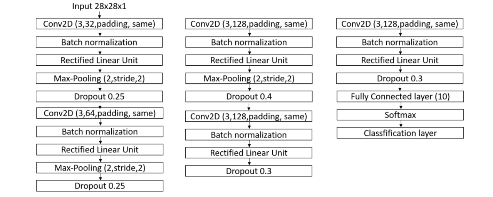

# 🧩 Plato Word Box Solver v1.1.0
This project is an automated OCR solution for solving the Word Box mini-game in the Plato Android app. It captures the window containing the game, extracts letter grid using computer-vision techniques, and converts the letters into text through OCR. The program then finds all possible word combinations, and automates the gameplay using mouse movements.


## Demo
### Old

### New 


## New Features
- Replaced EasyOCR with a custom-CNN model trained and validated on a cleaned char74k dataset for letter detection
- Significantly improved recognition accuracy, especially for difficult characters like **'I'** and **'J'**

### Performance Improvements
- Letter classification is now **significantly faster** than the previous EasyOCR-based method

### Bug Fixes
- Fixed incorrect detection of visually similar characters (e.g., I/J confusion)

## Table of Contents 
- [Features](#features)
- [Tech Stack](#tech-stack)
- [Getting Started](#getting-started)
- [Usage](#usage)
- [Project Structure](#project-structure)
- [How It Works](#how-it-works)
- [Limitations](#limitations)
- [Future Directions](#future-directions)
- [Contributing](#contributing)

## Features
- **OCR Processing:** Automatic letter extraction using custom CNN model for faster, more accurate letter recognition
- **Automated Gameplay:** Mouse movement automation based on word path
- **Up-to-date GUI:** Minimal, responsive interface built with CustomTKinter
- **Control Options:** Pause/resume, stop, and automation speed control functionality
- **Search Optimization:** A Trie-based backtracking search algorithm across the grid
[back to top](#table-of-contents)

## Tech Stack
### Frontend & GUI
- **[CustomTkinter](https://github.com/TomSchimansky/CustomTkinter)** - Modern, customizable GUI framework
- **Tkinter** - Base GUI toolkit for Python

### Computer Vision & OCR
- [OpenCV](https://opencv.org/): Image processing, contour detection, and preprocessing for recognition
- **[Pillow (PIL)](https://python-pillow.org/)** - Image manipulation and format handling
- Custom CNN model: Convolutional Neural Network trained on a cleaned Char74K dataset for letter classification
    
  [Reference Paper](https://iopscience.iop.org/article/10.1088/1757-899X/1125/1/012049/pdf)

### Automation & System Integration
- **[pywin32](https://github.com/mhammond/pywin32)** - Windows API integration for screen capture
- **[pynput](https://pynput.readthedocs.io/)** - Keyboard listener for real-time controls
- **[PyAutoGUI](https://pyautogui.readthedocs.io/)** - Mouse and keyboard automation

### Algorithms & Data Structures
- **Trie (Prefix Tree)** - Efficient storage of and recuse of over [~460k English words](https://github.com/dwyl/english-words) 
- **DFS (Depth-First Search)** - 8-directional grid traversal to find words
- **Backtracking** - Grid traversal with state management to prevent re-traversals


### Core Python Libraries
- **threading**: Allows for background task execution, thus preventing application freezes
- **re**: For text sanitization and validation using regex
- **math**: For grid calculations
- **pathlib**: File path handling of screenshots of the game

[back to top](#table-of-contents)
## Getting Started
### System Requirements
- Python 3.13+
- Operating System: Windows and Android OS
- Plato App installed on Android devices/emulator
- [Scrcpy](https://github.com/Genymobile/scrcpy): Free screen mirroring application for android devices

### Installation
1. **Clone the repo**
```bash
git clone https://github.com/G3rarrd/Automated-Plato-Word-Box-Solver
cd Automated-Plato-Word-Box-Solver
```

2. **Activate your Python Environment(venv or Anaconda)**
```bash
python -m venv venv
venv\Scripts\activate  # Windows
```

 4. **Install all dependencies**
```bash
pip install -r requirements.txt
```

5. **Run the application**
```bash
cd src
python main.py
```

[back to top](#table-of-contents)
## Usage
1. **Setup**: Ensure the Plato Word Box game is visible on your screen
2. **Screen Capture:** Enter the game window title to capture it.
3. **Letter Detection:** Click "Scan Window" to detect characters and contours on the grid.
4. **Start**: Click "Solve" to find all possible words in the grid and begin automation
5. **Control**: Use spacebar to pause/resume and esc to stop the solving automation.

[back to top](#table-of-contents)

## Project Structure
```bash
src/
├── core/                 # Core application logic
│   ├── controller.py           # Automation file
│   ├── word_box_solver_algo.py # Trie & search algorithms
│   └── word_box_solver_img_processing.py  # OCR & CV processing
├── ui/                   # User interface components
│   ├── colors.py              # Theme and color management
│   ├── fonts.py               # Font definitions and management  ← NEW
│   ├── frame_grid.py          # Grid display components
│   └── word_box_solver_settings_content.py  # Settings panel
├── fonts/            # Font files directory
│   ├── Poppins-Medium.ttf
│   ├── Poppins-Bold.ttf
│   ├── Poppins-Regular.ttf
│   └── Poppins-Thin.ttf
|	├── more...
├── screenshots/          # Captured game images
└── main.py              # Application entry point
```

[back to top](#table-of-contents)
## How It Works
1. **Screen Capture** : Captures the window containing the Plato game using Windows API after being provided the title of the window
2. **OCR Processing**:
	- Preprocesses image (grayscale, binary thresholding, gaussian blur(noise removal), image dilation to find singular contours of multi/singular-characters text)
	- Detects individual letter cells using contour analysis
	- Classifies letters using a **custom-trained CNN**, achieving high accuracy, including tricky letters like **'I'** (represented as l but easily converted to I) and **'J'**, and significantly faster than the previous EasyOCR approach.
3. **Word Search**:
	- Builds Trie from 460k+ word dictionary
	- Performs DFS with backtracking across 8 directions
	- Validates words against Trie dictionary
4. **Automation**:
	- Determines mouse positions relative to the captured game grid.  
	- Applies mouse movements and clicks along the paths corresponding to the found words during the word search phase.

[back to top](#table-of-contents)

## Limitations
- **Platform Constraints**: Currently Windows-only due to screen capture dependencies
- Limited to the English word dictionary only
- ~~**Unable to reliably detect some letters (most especially I and J). in some instances**~~ (solved) 
- ~~**Inefficient OCR Processing speed**~~  (solved)

[back to top](#table-of-contents)

## Future Directions
- Expand language support beyond English
- Explore mobile deployment or cross-platform compatibility

[back to top](#table-of-contents)

## Contributing
Contributions are welcomed! Please feel free to submit pull requests, report bugs, or suggest new features.

[back to top](#table-of-contents)